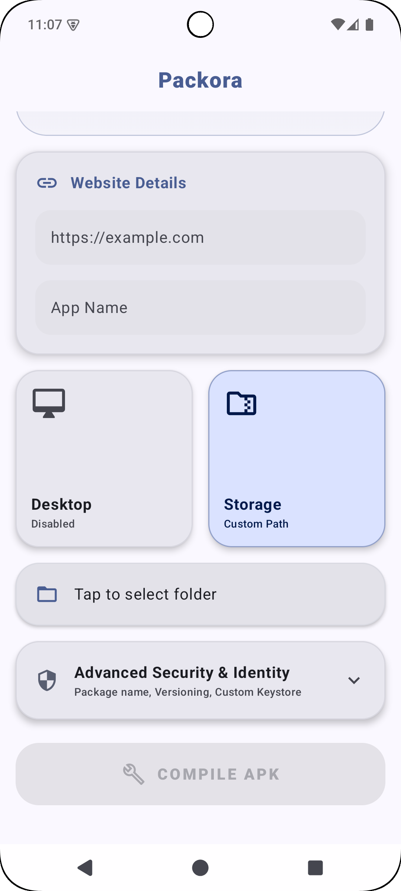

<p align="center">
  
</p>

<h1 align="center">Packora v2.1.0</h1>

<p align="center">
  <b>The ultimate on-device Web-to-APK engine for Android.</b><br>
  Built with Jetpack Compose, native in-house template compilation, binary AXML manipulation, and modern Bento UI architecture.
</p>

<p align="center">
  
  
  
  
  
</p>

---

## 📝 About Packora
Packora is a powerful, completely offline Android utility that enables you to convert any website into a standalone native Android application (APK) directly on your device. No cloud servers, no PC, no complex IDE setups. 

With **v2.1.0**, Packora features dynamic status bar and navigation bar contrast synchronization, web content algorithmic dark mode, Android Password Manager / Autofill Framework integration, high-precision icon rendering, and an updated build pipeline.

---

## 🛠️ Technology Stack

| Component | Technology | Version | Description |
| :--- | :--- | :--- | :--- |
| **Core Language** | Kotlin | `2.0.0` | Modern, safe, and asynchronous. |
| **UI Framework** | Jetpack Compose | `2024.12.01 (BOM)` | Declarative Bento grid interface. |
| **Template Engine** | In-House Android Template | `v2.1.0` | Native `:template` module with embedded WebView shell. |
| **Binary Engine** | Custom AXML Parser | `v2.1.0` | Direct binary `AndroidManifest.xml` & `.arsc` string manipulation. |
| **Security Layer**| apksig & Custom Keystore | `v2.1.0` | V2/V3 APK signing supporting custom PKCS12 / JKS keystores. |
| **Page Alignment**| 16KB Page Aligner | `v2.1.0` | Ensures native `.so` binaries align to 16KB pages for Android 15+. |

---

## ✨ Key Features in v2.1.0

### ⚡ Complete On-Device WebAPK Engine
*   **100% Offline Compilation**: Generate signed APKs instantly on your device without cloud dependencies.
*   **16KB Memory Page Alignment**: Realigns native `.so` libraries inside generated APKs to meet Android 15+ kernel memory constraints.
*   **Custom Storage Routing**: Choose where generated WebAPKs are stored on your device.

### 🎨 Dynamic System Bar & Dark Theme Effects
*   **Live Status Bar & Nav Bar Sync**: System bars dynamically match web header colors with automatic **Black / White** font & icon contrast.
*   **Algorithmic Dark Mode**: Automatically applies dark theme rendering to web content when system dark mode is active.
*   **Password Manager / Autofill**: Full native Autofill framework support for Google Password Manager, Bitwarden, 1Password, etc.
*   **Auto Favicon Downloader**: Scrapes high-resolution site icons with automatic stale-icon reset when switching URLs.

### 🌐 Advanced WebView Runtime
*   **Desktop Mode Toggle**: View desktop websites with standard responsive viewport scaling.
*   **Native File Downloads & Uploads**: Embedded Chrome FileChooser and DownloadManager integration with status bar notifications.

---

## 📸 Interactive UI Gallery

<table align="center">
  <tr>
    <td align="center"><b>Simple Dashboard</b></td>
    <td align="center"><b>Advanced Settings</b></td>
  </tr>
  <tr>
    <td></td>
    <td></td>
  </tr>
</table>

<table align="center">
  <tr>
    <td align="center"><b>Custom Keystore Setup</b></td>
    <td align="center"><b>Storage Location Picker</b></td>
  </tr>
  <tr>
    <td></td>
    <td></td>
  </tr>
</table>

---

## 🚀 Installation & Requirements

### System Requirements
* **OS**: Android 8.0 (Oreo) or higher (Min SDK 24, Target SDK 35).
* **Architecture**: `arm64-v8a`, `armeabi-v7a`, `x86`, `x86_64`.

---

## 🏗️ Build from Source

Ensure you have **Android Studio Ladybug** (or later) and **JDK 17/21** configured.

```bash
# Clone the repository
git clone https://github.com/maheswara660/Packora.git
cd Packora

# Build Packora release variant (automatically compiles :template and updates shell asset)
./gradlew :app:assembleRelease
```

---

## 📜 License
Packora is open-source software licensed under the **GNU General Public License v3.0**. See the [LICENSE](LICENSE) file for details.

---

<p align="center">
  <b>Packora v2.1.0 — Unlocking Web-to-APK limits.</b><br>
  Made with ❤️ in India
</p>
