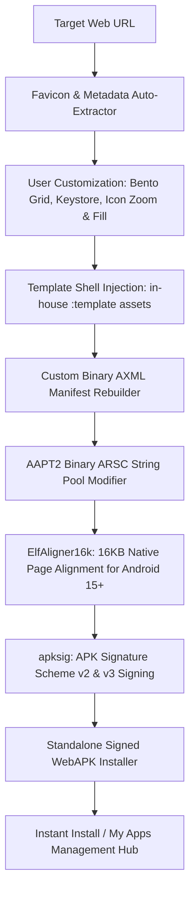

<p align="center">
  <a href="https://github.com/maheswara660/Packora">
    
  </a>
</p>

<h1 align="center">Packora v3.1.0</h1>

<p align="center">
  <b>High-Performance Standalone Android WebAPK Compiler — Completely On-Device & Offline.</b>
</p>

<p align="center">
  <a href="https://github.com/maheswara660/Packora/releases/latest"></a>
  <a href="https://kotlinlang.org"></a>
  <a href="https://developer.android.com/jetpack/compose"></a>
  <a href="https://developer.android.com/about/versions/15"></a>
  <a href="LICENSE"></a>
  <a href="https://ko-fi.com/maheswara660"></a>
</p>

> [!NOTE]
> **Zero Telemetry • 100% Offline • No Cloud Dependencies**  
> Packora runs an entire Android compilation and packaging pipeline right on your phone or tablet. It takes any Progressive Web App (PWA) or responsive website and outputs a standalone, production-ready Android APK with zero external servers or developer tools required.

---

## 📌 Table of Contents

- [Overview](#-overview)
- [Architecture & How It Works](#-architecture--how-it-works)
- [What's New in v3.1.0](#-whats-new-in-v310)
- [Key Features & Capabilities](#-key-features--capabilities)
  - [Dashboard & Bento Grid Customization](#-dashboard--bento-grid-customization)
  - [My Apps Management Hub](#-my-apps-management-hub)
  - [Standalone WebAPK Runtime](#-standalone-webapk-runtime)
  - [Binary Engine & APK Signing](#-binary-engine--apk-signing)
  - [Build History & Smart Versioning](#-build-history--smart-versioning)
  - [Settings & Dynamic Theming](#-settings--dynamic-theming)
- [Permissions & Security Model](#-permissions--security-model)
- [Technology Stack](#-technology-stack)
- [Repository Structure](#-repository-structure)
- [Building from Source](#-building-from-source)
- [Contributing](#-contributing)
- [License & Acknowledgments](#-license--acknowledgments)

---

## 💡 Overview

**Packora** bridges the gap between modern web applications and native Android experiences. While standard browsers offer simple "Add to Home Screen" shortcuts that stay bound to browser windows, tabs, and URL bars, Packora builds an **independent native APK** that:

- Runs in its own dedicated Android window with independent task affinity.
- Features custom app icons, package IDs, and versioning.
- Auto-injects ad-blockers, smart website footer hiding, and persistent session cookie sync.
- Supports native Google SSO via Android Account Manager and Google Play Services Auth.
- Embeds 16KB ELF page alignment for smooth compatibility with Android 15+ kernels.
- Signs packages with APK Signature Scheme v2 & v3 using built-in or custom PKCS12 / JKS certificates.

---

## ⚙️ Architecture & How It Works



1. **Asset & Metadata Harvesting**: Fetches high-resolution icons (HTML apple-touch, manifest, clearbit, duckduckgo, unavatar) and extracts dominant corner colors.
2. **Binary Modification Without AAPT**: In-house binary parsers rewrite `AndroidManifest.xml` (AXML) and `resources.arsc` directly in byte buffers, avoiding bulky command-line toolchains.
3. **Android 15+ 16KB Page Alignment**: Re-aligns all native ELF binaries (`.so` files) within ZIP archives to 16,384-byte boundaries.
4. **V2/V3 APK Signature**: Generates RFC-compliant cryptographic signatures on-device using ECDSA or RSA certificates.

---

## 🚀 What's New in v3.1.0

- **Floating Window & Freeform Windowing Engine**:
  - Native `WINDOWING_MODE_FREEFORM` (`ActivityOptions.setWindowingMode(5)`) and Picture-in-Picture fallback allowing compiled WebAPKs to run as movable, resizable floating windows directly over other apps and games.
  - Declared `MULTIWINDOW_LAUNCHER` category, Samsung Multi-Window metadata (`com.samsung.android.sdk.multiwindow.penwindow.enable`, `enableInstanceForAll`), and default window layout dimensions (`600dp x 800dp`), appearing in system "Open in pop-up view" launchers across Samsung One UI, Xiaomi HyperOS, ColorOS/OxygenOS, and stock Android.
- **Google Sign-In & Native Account Chooser Integration**:
  - Suppressed the `X-Requested-With` header on authentication endpoints via `WebSettingsCompat`, preventing Google OAuth from blocking in-app logins with error 403 `disallowed_useragent`.
  - Configured authentic modern Chrome User-Agent adhering to Google Identity Platform security policies.
  - Implemented custom popup dialog windowing for multi-window OAuth redirects with a 170-alpha darkened scrim backdrop, rendering Google's account picker as an authentic centered modal.
- **Passwordless Email Magic Link Clipboard Sync & Manual Input**:
  - Automatic clipboard scanner on app resume detecting copied magic auth links (Notion, Slack, Substack, Medium, etc.) with instant deep navigation.
  - Dedicated manual paste dialog with real-time URL validation to instantly route magic links directly into the active session.
- **Dedicated In-App Update Bottom Sheet**:
  - Converted the updates dialog into an `App Update Ready!` installation bottom sheet with version progression (`v<oldVersion> ➔ v<newVersion>`), build details, and primary `INSTALL UPDATE` action.
- **Updates Screen Card Parity & Settings Update Spinner**:
  - Standardized `UpdateAppCard` to match `MyAppsScreen` and `HistoryScreen` 1:1 with elevated rounded surfaces, launcher icon boxes, and compilation chips.
  - Replaced static "Checking" text on the Settings update tile with a Material 3 circular progress indicator.

---

## ✨ Key Features & Capabilities

### 🎨 Dashboard & Bento Grid Customization
- **Website Details Hero Card**: Interactive URL input with clipboard auto-paste, Web icon badge, and quick clearing.
- **5-Card Quick Toggles Bento Grid**:
  - 🖥️ **Desktop Mode**: Renders sites with a full desktop viewport and Chrome desktop User-Agent.
  - 🌙 **Force Dark Mode**: Enables algorithmic darkening for sites without native dark themes.
  - 🔍 **Pinch Zoom**: Toggles multi-touch zoom controls.
  - 📋 **Allow Text Copying**: Overrides CSS user-select locks to permit text selection.
  - 🛡️ **Hide Web Footer**: Intelligently detects and hides site legal/copyright footers while keeping web app navigation intact.
- **Inline Pop-Under Feature Cards**:
  - 🆔 **Package Identity & Versioning**: Custom package names and automatic version incrementing (`versionCode` + `versionName`).
  - 📁 **Storage Folder**: Choose destination folders using Android's Storage Access Framework (SAF).
  - 🔑 **Custom Signing Keystore**: Generate custom PKCS12 certificates (Common Name, Organization, Unit, Validity Years, Key Password).
- **Icon Zoomer & Color Eyedropper**:
  - Auto-extracts dominant background corner colors.
  - 31+ curated color fill options or custom hex input.
  - Steppers (`-` / `+`) and discrete slider for icon scaling.

### 📱 My Apps Management Hub
- **Installed App Tracking**: Scans and displays WebAPKs generated by Packora on your device.
- **Update Engine**: Detects newer builds from history and compiles seamless updates matching the exact original configuration.
- **Comprehensive Actions**: Open app, rebuild with reused parameters, reinstall existing APKs, or initiate uninstallation.

### 🌐 Standalone WebAPK Runtime
- **Site-Native Dark Mode**: Automatically honors website dark/light styling without distortion.
- **Ad & Gambling Redirect Blocker**: Real-time interceptor blocking intrusive popunders, ad tracking scripts, and gambling domains.
- **Whitespace Collapsing**: Uses dynamic CSS and `MutationObserver` to collapse empty ad slots to zero height.
- **Google OAuth & Device Account Sync**: Automatic discovery of logged-in Google Accounts via `AccountManager` for 1-tap Google Sign-In.
- **Persistent Session Cookie Disk Sync**: Proactive cookie flushing ensuring login states persist across device restarts.
- **HTML5 File Picker & WebRTC**: Supports camera, microphone, geolocation, and multi-file document uploads.

### ⚡ Binary Engine & APK Signing
- **100% Offline Compilation**: Operates without AAPT, AAPT2, or external Java runtimes.
- **16KB Page Alignment**: Guarantees Android 15 kernel compatibility via `ElfAligner16k`.
- **Dual Signature Scheme**: Generates APK Signature Scheme v2 and v3 signatures compliant with Google Play and Android package verifiers.

### 📜 Build History & Smart Versioning
- **1-Per-Row Grid**: Beautiful history cards displaying actual app icons, build timestamps, versions, package names, and output paths.
- **Config Auto-Matching**: Entering a previously built URL automatically populates earlier settings and increments the version string.

### ⚙️ Settings & Dynamic Theming
- **Material You Dynamic Theming**: Adapts to system wallpaper colors or selects from **22+ hand-crafted Color Accents**.
- **Browser Engine Selector**: Switch between System Default WebView, Chrome Engine, or Custom Tab runtimes.
- **Full Factory Reset**: 1-tap wipe to restore all settings and form inputs to default values.

---

## 🔒 Permissions & Security Model

Packora adheres to strict privacy standards. It contains **no third-party tracking SDKs**, **no analytics**, and **no network calls** other than loading the target website you specify.

| Permission | Purpose in Packora |
| :--- | :--- |
| `INTERNET` | Loading web applications and downloading target web favicons. |
| `ACCESS_NETWORK_STATE` | Detecting online/offline connectivity to display offline fallback screens. |
| `QUERY_ALL_PACKAGES` | Inspecting installed WebAPKs for update status and management in My Apps. |
| `REQUEST_INSTALL_PACKAGES` | Triggering native Android package installation for compiled APKs. |
| `REQUEST_DELETE_PACKAGES` | Triggering native Android package uninstallation from My Apps bottom sheet. |
| `POST_NOTIFICATIONS` | Delivering status bar notifications for build completion and WebAPK push events. |
| `READ_MEDIA_IMAGES` / `READ_EXTERNAL_STORAGE` | Selecting custom launcher icons and files from device storage. |
| `CAMERA` / `RECORD_AUDIO` | Delegated to WebAPK runtime for HTML5 WebRTC video calls and audio capture. |
| `ACCESS_FINE_LOCATION` | Delegated to WebAPK runtime for map services and geolocation. |

---

## 🛠️ Technology Stack

| Component | Library / Framework | Version | Details |
| :--- | :--- | :--- | :--- |
| **Language** | Kotlin | `2.2.10` | Coroutines, Flow, modern functional syntax |
| **UI Toolkit** | Jetpack Compose | `2026.02.01 (BOM)` | Material Design 3, Navigation, Animations |
| **Android SDK** | Android SDK | `API 35 (15)` | Min SDK: 24 (Android 7.0+), Compile: 35 |
| **Signing Engine** | Android `apksig` | `8.3.0` | Cryptographic V2 / V3 signature generation |
| **Page Alignment** | In-House `ElfAligner16k` | `v3.1.0` | 16KB ELF boundary alignment |
| **Binary Engine** | In-House `AxmlRebuilder` & `ArscRebuilder` | `v3.1.0` | Low-level byte-level binary manifest rewriter |
| **Template Engine** | In-House `:template` Shell | `v3.1.0` | High-performance standalone WebAPK wrapper |

---

## 📂 Repository Structure

```text
Packora/
├── app/                                 # Primary Packora application module
│   ├── src/main/java/.../packora/
│   │   ├── MainActivity.kt              # App entry point & navigation host
│   │   ├── builder/                     # Binary compiler engine
│   │   │   ├── ApkBuilder.kt            # Compilation pipeline orchestrator
│   │   │   ├── AxmlRebuilder.kt         # Binary AndroidManifest.xml rebuilder
│   │   │   ├── ArscRebuilder.kt         # Binary resources.arsc rebuilder
│   │   │   ├── ElfAligner16k.kt         # 16KB ELF boundary aligner
│   │   │   ├── JarSigner.kt             # apksig V2/V3 cryptographic signing
│   │   │   └── ZipAligner.kt            # 4-byte ZIP entry alignment
│   │   ├── manager/                     # Persistent managers
│   │   │   ├── BuildHistoryManager.kt   # History tracking & auto-versioning
│   │   │   └── PackoraPreferencesManager.kt # User settings & accents
│   │   └── ui/                          # Jetpack Compose UI screens
│   │       ├── BuildScreen.kt           # Dashboard & Bento Builder UI
│   │       ├── MyAppsScreen.kt          # Installed WebAPKs manager & search
│   │       ├── HistoryScreen.kt         # Build history grid
│   │       ├── SettingsScreen.kt        # App configuration & accents
│   │       └── AboutScreen.kt           # App info, credits & links
│   └── proguard-rules.pro               # App module R8/ProGuard configuration
├── template/                            # Embedded WebAPK shell source module
│   ├── src/main/java/.../template/
│   │   └── MainActivity.kt              # Standalone WebAPK activity window
│   └── proguard-rules.pro               # Shell R8/ProGuard configuration
├── .github/                             # Workflows & community templates
│   ├── workflows/build.yml              # CI/CD multi-architecture release builder
│   └── ISSUE_TEMPLATE/                  # GitHub issue templates
├── CHANGELOG.md                         # Detailed version changelog
└── README.md                            # Project documentation
```

---

## 🏗️ Building from Source

### Prerequisites
- **JDK 17** or higher configured (`JAVA_HOME`).
- **Android Studio Ladybug (2024.2+)** or command-line Android SDK.
- **Android SDK Platform 35** and **Build-Tools 35.0.0**.

### Quick Build Instructions

```bash
# 1. Clone the repository
git clone https://github.com/maheswara660/Packora.git
cd Packora

# 2. Compile debug APK
./gradlew :app:assembleDebug

# 3. Compile full release APKs (Universal + ABI splits)
./gradlew :app:assembleRelease
```

Compiled APK files will be located at:
- Debug: `app/build/outputs/apk/debug/app-debug.apk`
- Release: `app/build/outputs/apk/release/`

---

## 🤝 Contributing

Contributions are warmly welcome! Whether fixing a bug, suggesting a feature, or optimizing the binary engine:

1. **Fork** the repository on GitHub.
2. **Create a branch** for your feature:
   ```bash
   git checkout -b feature/my-new-feature
   ```
3. **Commit** your changes:
   ```bash
   git commit -m "feat: Add support for custom WebChromeClient geolocation"
   ```
4. **Push** to your fork:
   ```bash
   git push origin feature/my-new-feature
   ```
5. **Open a Pull Request** with a detailed explanation of your changes.

Please make sure your code adheres to Kotlin coding conventions and passes `./gradlew :app:assembleDebug`.

---

## 📜 License & Acknowledgments

Packora is free and open-source software licensed under the **[GNU General Public License v3.0](LICENSE)**.

- **Author & Lead Developer**: [Maheswara660](https://github.com/maheswara660)
- **Support the Project**:
  - [Buy me a coffee on Ko-fi](https://ko-fi.com/maheswara660)
  - [GitHub Sponsors](https://github.com/sponsors/maheswara660)

---

<p align="center">
  <b>Packora v3.1.0 — Unlocking Web-to-APK Limits.</b><br>
  Built with ❤️ for the Android open-source community.
</p>
