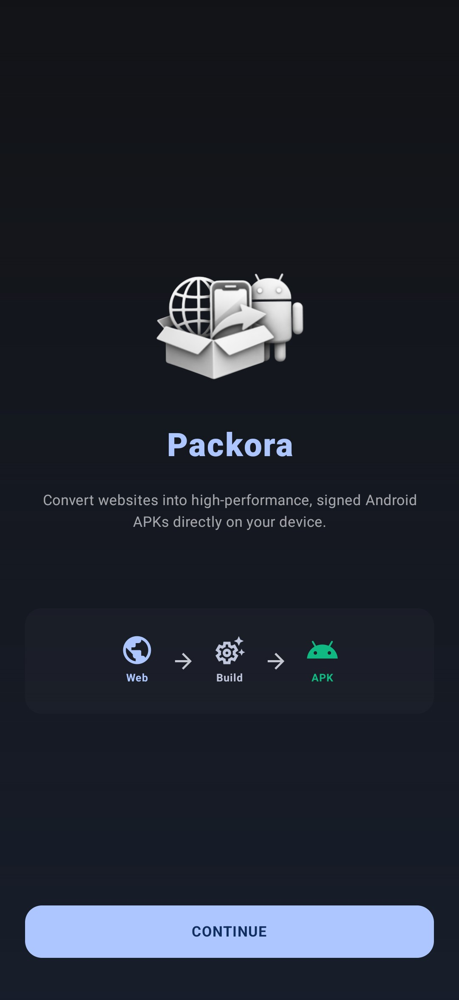
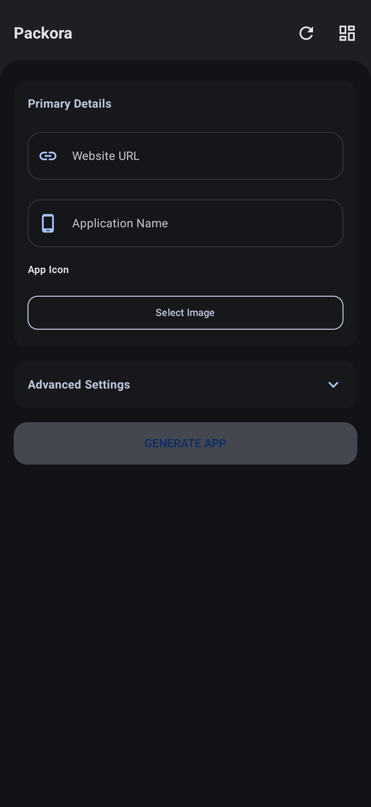
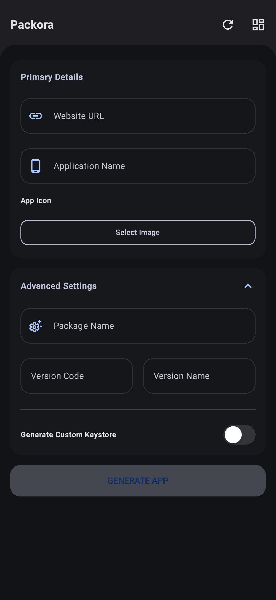
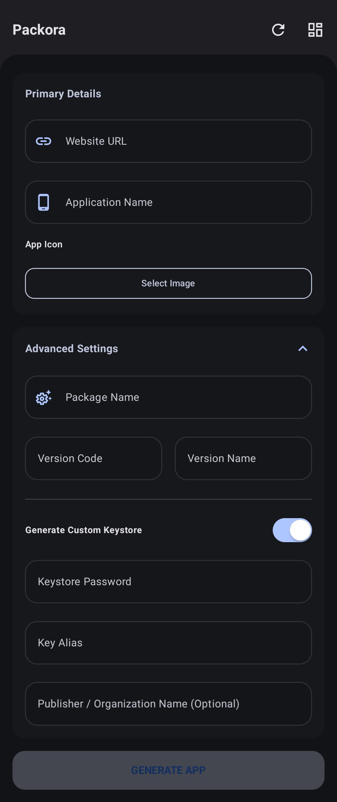

<p align="center">
  
</p>

<h1 align="center">Packora</h1>

<p align="center">
  <b>The ultimate on-device Web-to-APK engine for Android.</b><br>
  Built with the cutting-edge Jetpack Compose, binary AXML manipulation, and the "Inverted Corner" design language.
</p>

<p align="center">
  
  
  
  
</p>

---

## 📝 About Packora
Packora is a powerful, completely offline Android utility that lets you generate custom WebAPKs directly on your phone. No cloud servers. No Android Studio. No waiting. It combines a seamless "Boxed Inverted" design philosophy with a robust native compiling engine. Packora is engineered for users who demand both aesthetic beauty and absolute control over their web-app packaging.

---

## 🛠️ Technology Stack
Packora utilizes industry-standard technologies to ensure a stable and fluid experience.

| Component | Technology | Version | Description |
| :--- | :--- | :--- | :--- |
| **Core Language** | Kotlin | `2.0.0` | Modern, safe, and powerful. |
| **UI Framework** | Jetpack Compose | `2024.12.01 (BOM)` | Declarative UI for a responsive interface. |
| **Binary Engine** | Custom AXML Parser | `1.0.0` | Manipulates binary `AndroidManifest.xml` natively. |
| **Security Layer**| apksig (Google) | `Standard`| Enterprise-grade V2/V3 APK signing logic. |
| **Preferences** | SharedPreferences | `Standard` | Reliable persistence for builder configuration. |

---

## ✨ Key Features

### 📱 On-Device Compilation
*   **Zero Dependencies**: Build Android apps 100% offline using an embedded WebAPK shell.
*   **Rapid Processing**: Generate install-ready APKs in seconds.
*   **Full Independence**: Completely bypasses the need for cloud servers or PC IDEs.

### ⚡ Dynamic AXML Rebuilding
*   **Binary Level Editing**: Custom parser natively modifies package names and version codes.
*   **Deep Link Injection**: Adjusts Intent filters to seamlessly wrap target URLs.
*   **App Title Control**: Modifies binary XML structures to inject your chosen app name perfectly.

### 🎨 Signature Aesthetics & Resources
*   **Inverted Corners**: A unique boxed UI that provides a physical, tactile feel.
*   **Resource Injection**: Effortlessly injects your custom branding into compiled `.arsc` tables.
*   **Multiple Workflows**: Choose from Simple (1-click), Power User, and Advanced creation modes.
*   **Premium Animations**: Smooth transitions and translucent Glassmorphic design integrations.

---

## 📸 Interactive UI Gallery

<table align="center">
  <tr>
    <td align="center"><b>Welcome to Packora</b></td>
    <td align="center"><b>How It Works</b></td>
  </tr>
  <tr>
    <td></td>
    <td></td>
  </tr>
</table>

### 🛠️ Choose Your Workflow
<table align="center">
  <tr>
    <td align="center"><b>Simple Mode</b><br><i>(1-Click Build)</i></td>
    <td align="center"><b>Advanced Mode</b><br><i>(Custom Icons & Names)</i></td>
    <td align="center"><b>Power User Mode</b><br><i>(Full Manifest Control)</i></td>
  </tr>
  <tr>
    <td></td>
    <td></td>
    <td></td>
  </tr>
</table>

---

## 🚀 Installation & Requirements

### System Requirements
* **OS**: Android 8.0 (Oreo) or higher (Min SDK 26).
* **Architecture**: Supported on `arm64-v8a`, `armeabi-v7a`, `x86`, and `x86_64`.
* **Compiled SDK**: 35.

---

## 🏗️ Build from Source
Ensure you have **Android Studio Ladybug** (or later) and **JDK 17** configured.

```bash
# Clone the repository
git clone https://github.com/maheswara660/Packora.git

# Enter the project directory
cd Packora

# Build the release variant
./gradlew assembleRelease
```

---

## ❤️ Support & Community
Packora is a labor of love by a **solo developer**. Your support directly fuels the development of new features!

* ⭐ **Star**: Please give this project a star if you find it useful.
* ☕ **[Buy me a coffee](https://ko-fi.com/maheswara660)**: Support my work via Ko-fi.
* 🤝 **Contribute**: Check out the [Contributing Guidelines](.github/CONTRIBUTING.md).

---

## 📜 License
Packora is open-source software licensed under the **GNU General Public License v3.0**. See the [LICENSE](LICENSE) file for more information.

---

## ✉️ Message from Developer
> "Packora was born out of a desire for an app builder that feels as good as it compiles. Every inverted corner and every binary modification has been tuned to provide a premium, lightning-fast experience on Android. I hope Packora becomes your ultimate tool for app creation."
> — **Maheswara660**

<p align="center">
  <b>Packora — Unlocking Web-to-APK limits.</b><br>
  Made with ❤️ in India
</p>
