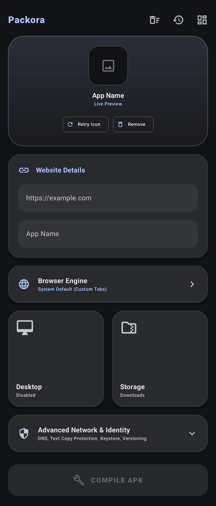
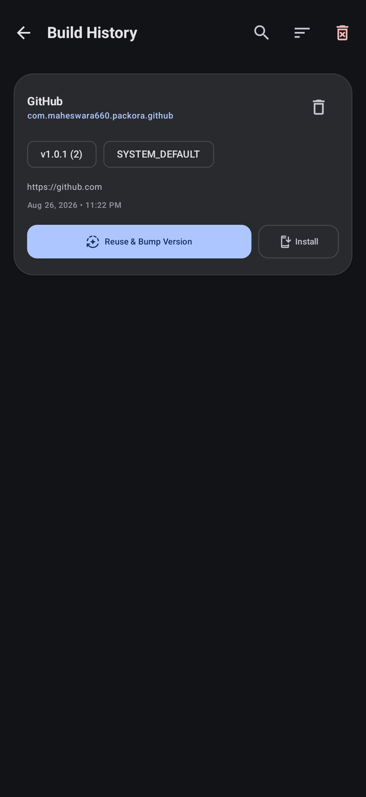
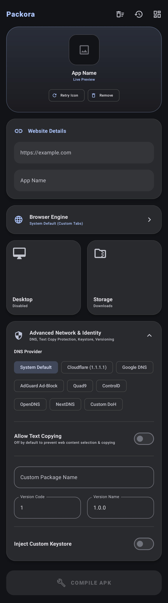
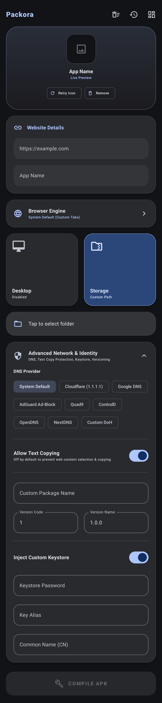

<p align="center">
  <a href="https://github.com/maheswara660/Packora">
    
  </a>
</p>

<h1 align="center">Packora v2.2.0</h1>

<p align="center">
  <b>Transforming Any Web Application into High-Performance Native Standalone Android WebAPKs — Completely On-Device.</b>
</p>

<p align="center">
  <a href="https://github.com/maheswara660/Packora/releases"></a>
  <a href="https://kotlinlang.org"></a>
  <a href="https://developer.android.com/jetpack/compose"></a>
  <a href="https://developer.android.com/about/versions/15"></a>
  <a href="LICENSE"></a>
</p>

---

## 📌 Table of Contents
- [About Packora](#-about-packora)
- [Interactive UI Gallery](#-interactive-ui-gallery)
- [Core Capabilities](#-core-capabilities)
- [Technology Stack](#-technology-stack)
- [System Requirements & Build Instructions](#-system-requirements--build-instructions)
- [Contributing](#-contributing)
- [License & Credits](#-license--credits)

---

## 📝 About Packora

**Packora** is an advanced, privacy-focused Android application that compiles any web application or website into a native, standalone Android APK file **directly on your device**. 

Unlike web wrappers or cloud-based compilers, Packora operates **100% offline without external servers, desktop tools, or complex IDEs**. It features a native in-house `:template` compilation module, custom binary **AXML** and **ARSC** string pool parsers, **V2/V3 APK signing**, **16KB ELF page alignment for Android 15+**, **DoH Encrypted DNS**, and **Smart History Auto-Versioning**.

---

## 📸 Interactive UI Gallery

<table align="center">
  <tr>
    <td align="center" width="50%">
      <b>📱 Studio Dashboard</b><br>
      <sub>Live app icon preview, website URL inputs, browser engine selection, and Bento feature cards.</sub>
    </td>
    <td align="center" width="50%">
      <b>📜 Build History & Auto-Versioning</b><br>
      <sub>Smart URL history auto-matching with automatic <code>versionCode</code> (+1) bumping and 1-tap reinstall.</sub>
    </td>
  </tr>
  <tr>
    <td align="center">
      
    </td>
    <td align="center">
      
    </td>
  </tr>
</table>

<table align="center">
  <tr>
    <td align="center" width="50%">
      <b>🔒 Advanced Privacy & DoH</b><br>
      <sub>DoH Encrypted DNS chips (Cloudflare, Google, AdGuard, Quad9, NextDNS), text copy protection, and package configuration.</sub>
    <td align="center" width="50%">
      <b>🔑 Custom Keystore & Storage</b><br>
      <sub>SAF custom storage folder selection and PKCS12 / JKS custom keystore signing parameters.</sub>
    </td>
  </tr>
  <tr>
    <td align="center">
      
    <td align="center">
      
    </td>
    </td>
  </tr>
</table>

---

## ✨ Core Capabilities

### ⚡ Standalone WebAPK Runtime Engine
* **100% Native App Window**: Generated WebAPKs load target URLs directly within their own standalone activity window without launching external browser apps.
* **Shared Cookie & Session Sync**: Integrates system `CookieManager` with standard Android Mobile Chrome User-Agent headers, allowing web applications (Google, GitHub, Twitter, Spotify) to authorize logins and persist web sessions.
* **Password Manager & Autofill Framework**: Enables native Android Autofill framework integration (`IMPORTANT_FOR_AUTOFILL_YES`) for Google Password Manager, Bitwarden, and 1Password.

### 🌐 Multi-Engine Runtime & DNS Privacy
* **Versatile Browser Engines**:
  * **System Default (Custom Tabs)**: Shares device browser logins, sessions, and cookies.
  * **Built-in Shell**: Integrated WebView container with custom navigation controls.
  * **Individual Standalone**: Isolated private container per generated app.
* **Encrypted DoH Providers**: Native support for Cloudflare (1.1.1.1), Google DNS, AdGuard Ad-Block, Quad9, ControlD, OpenDNS, NextDNS, and custom DoH URLs.

### 📜 Smart Build History & Auto-Versioning
* **Automatic Version Bumping**: Automatically matches target URLs against previous build history on entry/autofill and increments `versionCode` (`+1`) and `versionName` (`1.0.0` ➔ `1.0.1`), resolving `INSTALL_FAILED_UPDATE_INCOMPATIBLE` package update conflicts.
* **1-Tap Rebuild & Install**: Tap any past build card in History to instantly reload configuration details or trigger direct APK installation.

### 🎨 Bento UI & Dynamic Design System
* **Selection BottomSheets**: Sleek Modal BottomSheet menus for Theme (System, Light, Dark, AMOLED Pitch Black), Color Accent (Material You, Emerald, Ocean, Purple, Amber), and Browser Engine, complete with `CANCEL` and `OK` action buttons.
* **Live Theme Updates**: Theme and accent color modifications update dynamically across all screens in real-time without app restarts.
* **Gesture Navigation Optimization**: Dynamic bottom inset padding calculation reduces empty bottom space to `4.dp` when gesture navigation mode is active.
* **Ported Chronora AboutScreen**: Features dynamic app icon extraction, developer showcase card (`Developed by Maheswara660`), bento metrics grid, grouped action cards, and community footer.

### 📹 WebRTC, Camera, Microphone & Location Permissions
* **WebRTC Video/Audio Calls**: Injected `CAMERA`, `RECORD_AUDIO`, and `MODIFY_AUDIO_SETTINGS` with `WebChromeClient.onPermissionRequest` handling.
* **HTML5 Geolocation & Haptics**: Injected `ACCESS_FINE_LOCATION`, `ACCESS_COARSE_LOCATION`, `VIBRATE`, and `USE_BIOMETRIC` permissions.

---

## 🛠️ Technology Stack

| Component | Library / Framework | Version | Purpose |
| :--- | :--- | :--- | :--- |
| **Language** | Kotlin | `2.0.0` | Asynchronous coroutines & native build pipelines. |
| **UI Framework** | Jetpack Compose | `2024.12.01 (BOM)` | Modern Material 3 Bento UI architecture. |
| **Template Engine** | In-House `:template` | `v2.2.0` | Native WebAPK shell asset generator. |
| **Binary Engine** | Custom AXML & ARSC | `v2.2.0` | Binary manifest & AAPT2 string pool rebuilder. |
| **Signing Engine** | `apksig` & Keystore | `8.3.0` | V2/V3 APK signing & PKCS12 / JKS custom key injection. |
| **Page Alignment** | `ElfAligner16k` | `v2.2.0` | Native `.so` 16KB page alignment for Android 15+ kernels. |

---

## 🚀 System Requirements & Build Instructions

### System Requirements
* **Operating System**: Android 8.0 (Oreo) or higher (Min SDK 24, Target SDK 35).
* **Supported Architectures**: `arm64-v8a`, `armeabi-v7a`, `x86`, `x86_64`.

### 🏗️ Building from Source

Ensure you have **Android Studio Ladybug** (or later) and **JDK 17** configured:

```bash
# 1. Clone the repository
git clone https://github.com/maheswara660/Packora.git
cd Packora

# 2. Build Packora release APK (automatically compiles :template and updates shell asset)
./gradlew :app:assembleRelease
```

The compiled release APK will be saved at:
`app/build/outputs/apk/release/app-release.apk`

---

## 🤝 Contributing

Contributions, feature requests, and bug reports are welcome!
1. Fork the repository on GitHub.
2. Create your feature branch (`git checkout -b feature/AmazingFeature`).
3. Commit your changes (`git commit -m 'Add some AmazingFeature'`).
4. Push to the branch (`git push origin feature/AmazingFeature`).
5. Open a Pull Request.

---

## 📜 License & Credits

Packora is open-source software licensed under the **GNU General Public License v3.0**. See the [LICENSE](LICENSE) file for details.

* **Created & Maintained by**: [Maheswara660](https://github.com/maheswara660)
* **Donations & Support**: [Maheswara660](https://ko-fi.com/maheswara660)

---

<p align="center">
  <b>Packora v2.2.0 — Unlocking Web-to-APK Limits.</b><br>
  Made with ❤️ for the Android Community
</p>
