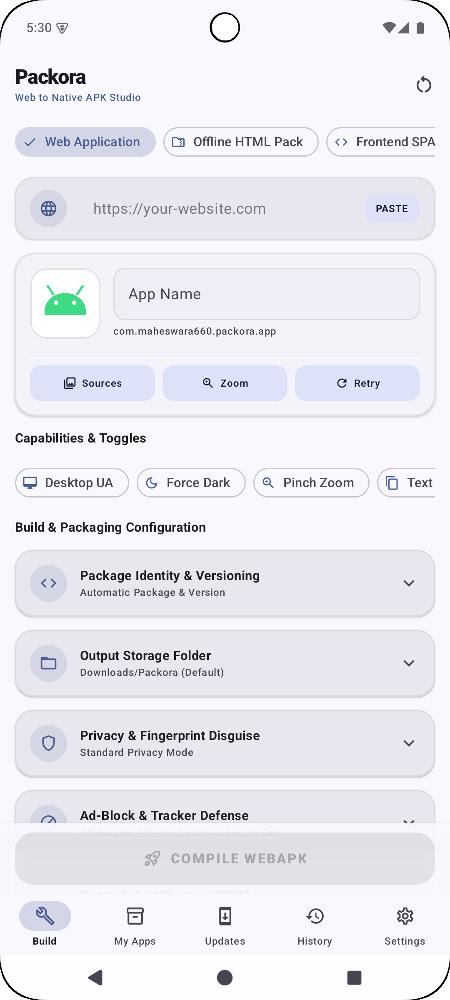
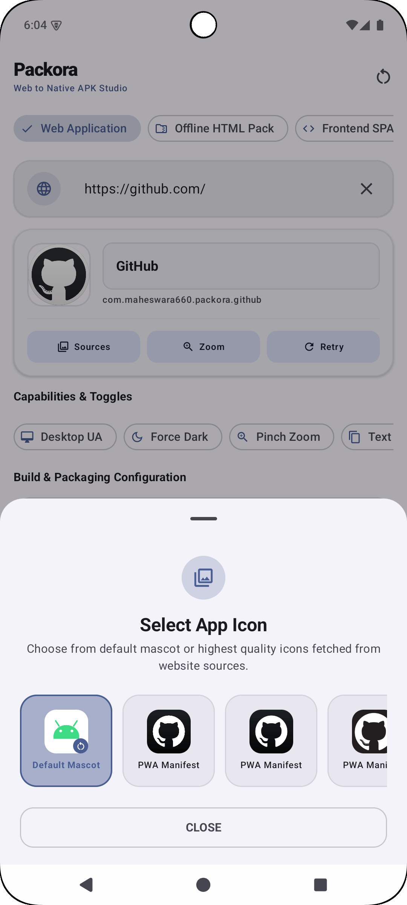
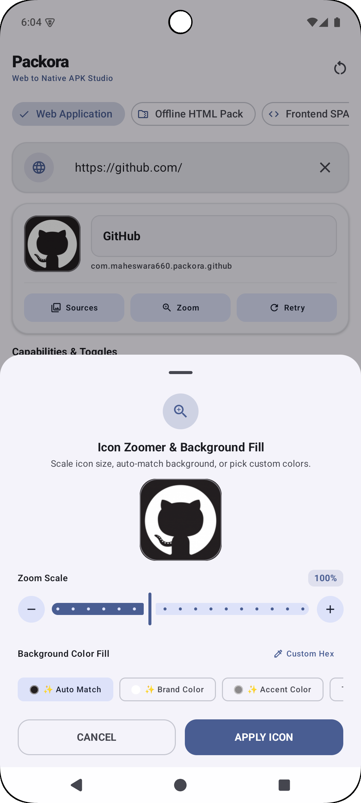
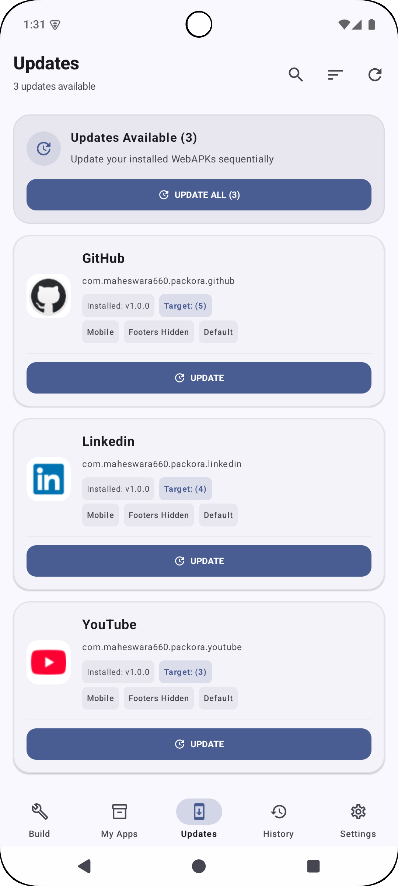
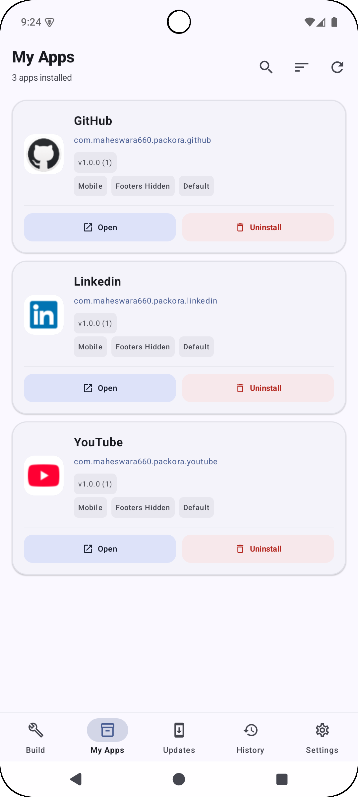
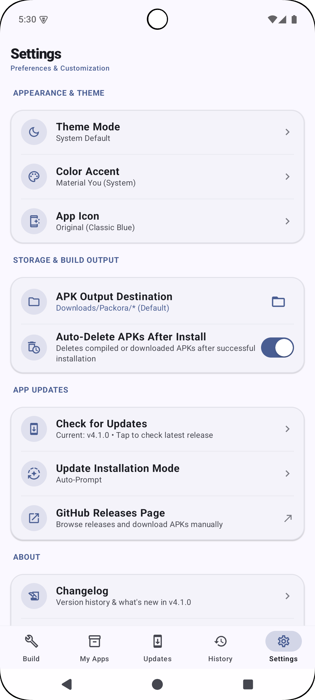
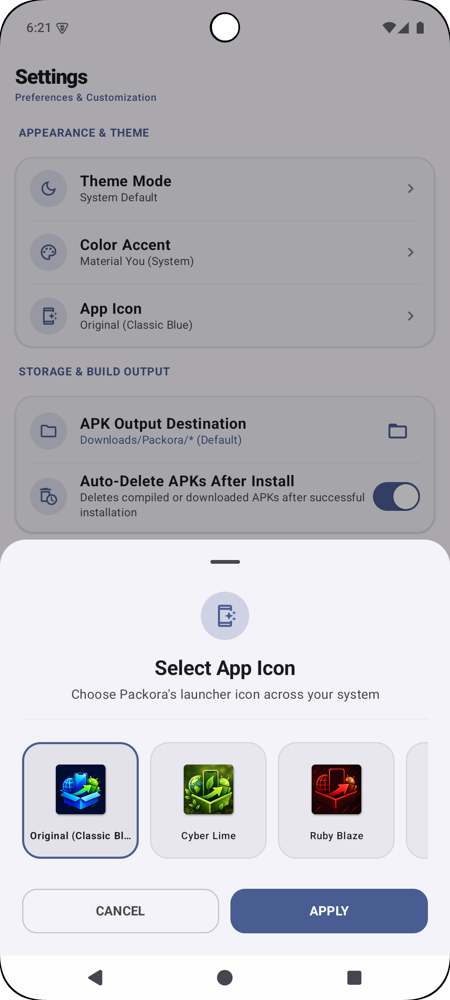
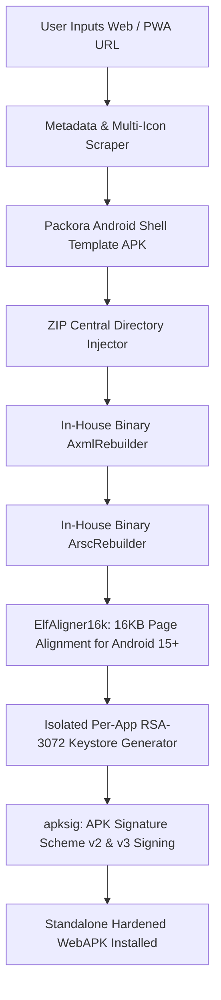

<p align="center">
  <a href="https://github.com/maheswara660/Packora">
    
  </a>
</p>

<h1 align="center">Packora v5.0.0</h1>

<p align="center">
  <b>Next-Gen Standalone Android WebAPK Compiler — 100% On-Device, Offline & Privacy-Hardened.</b>
</p>

<p align="center">
  <a href="https://github.com/maheswara660/Packora/releases/latest"></a>
  <a href="https://maheswara660.github.io/Packora/"></a>
  <a href="https://kotlinlang.org"></a>
  <a href="https://developer.android.com/jetpack/compose"></a>
  <a href="https://developer.android.com/about/versions/15"></a>
  <a href="LICENSE"></a>
  <a href="https://github.com/sponsors/maheswara660"></a>
  <a href="https://ko-fi.com/maheswara660"></a>
</p>

> [!NOTE]
> **Zero Telemetry • 100% Offline • No Cloud Dependencies**  
> Packora runs an entire Android compilation, bytecode modification, and packaging pipeline directly on your phone or tablet. It transforms any Progressive Web App (PWA) or responsive website into an independent, production-ready Android APK with custom signing keys, built-in ad blocking, encrypted DNS, and anti-fingerprint protection — zero PC or developer toolchains required.

---

## 📌 Table of Contents

- [Overview](#-overview)
- [Screenshots](#-screenshots)
- [Architecture & How It Works](#-architecture--how-it-works)
- [What's New in v5.0.0](#-whats-new-in-v500)
- [Key Features & Capabilities](#-key-features--capabilities)
  - [🎨 Dashboard & WebAPK Build Studio](#-dashboard--webapk-build-studio)
  - [🛡️ Stealth Privacy Shield (50+ Vectors)](#️-stealth-privacy-shield-50-vectors)
  - [🚫 Built-in Ad & Tracker Blocker](#-built-in-ad--tracker-blocker)
  - [🔒 Encrypted DNS-over-HTTPS (DoH)](#-encrypted-dns-over-https-doh)
  - [🔑 Deterministic Per-App Keystores](#-deterministic-per-app-keystores)
  - [🧹 150+ Multilingual Smart Footer Hider](#-150-multilingual-smart-footer-hider)
  - [🔄 Dedicated Updates Hub](#-dedicated-updates-hub)
  - [📱 My Apps Management Hub](#-my-apps-management-hub)
  - [📜 Build History & Config Reusability](#-build-history--config-reusability)
  - [🎨 Dynamic App Icons & Theming](#-dynamic-app-icons--theming)
  - [⚙️ Settings & Modern Controls](#️-settings--modern-controls)
- [Permissions & Security Model](#-permissions--security-model)
- [Technology Stack](#-technology-stack)
- [Repository Structure](#-repository-structure)
- [Building from Source](#-building-from-source)
- [Official Documentation](#-official-documentation)
- [Contributing](#-contributing)
- [License & Acknowledgments](#-license--acknowledgments)

---

## 💡 Overview

**Packora** bridges the gap between modern web applications and native Android experiences. While standard browsers offer simple "Add to Home Screen" shortcuts that remain bound to browser tabs, address bars, and shared cookie jars, Packora compiles a **standalone native WebAPK** that:

- Runs in its own dedicated Android application window with independent task affinity.
- Features custom app icons, distinct package IDs, and automated version increments.
- Injects a **50+ vector Stealth Privacy Shield** that neutralizes canvas, WebGL, audio, and WebRTC fingerprinting.
- Resolves network requests through **Encrypted DNS-over-HTTPS (DoH)** with 9 privacy resolvers.
- Blocks ads and tracking telemetry out of the box using high-efficiency local rule engines.
- Signs packages with isolated **deterministic RSA-3072 keystores** supporting APK Signature Scheme v2 & v3.
- Aligns native ELF binaries to **16KB boundaries** for full compatibility with Android 15+ kernels.
- Supports native Google SSO via Android Account Manager and Google Play Services Auth.

---

## 📱 Screenshots

<div align="center">

| Build Studio | URL Icon Extractor | Icon Canvas Editor | Updates Hub |
| :---: | :---: | :---: | :---: |
|  |  |  |  |

| My Apps Manager | Build History | Settings & Automation | Dynamic App Icons |
| :---: | :---: | :---: | :---: |
|  |  |  |  |

</div>

---

## ⚙️ Architecture & How It Works



1. **Asset & Metadata Harvesting**: Scrapes target manifests, high-res Apple touch icons, favicons, theme colors, and page metadata directly from the URL.
2. **Binary Modification Without AAPT**: In-house low-level binary parsers rewrite `AndroidManifest.xml` (AXML) and `resources.arsc` directly in byte buffers, avoiding bulky command-line toolchains.
3. **Android 15+ 16KB Page Alignment**: Re-aligns all native ELF binaries (`.so` files) within ZIP archives to 16,384-byte boundaries.
4. **Isolated Key Provisioning**: Generates deterministic, package-specific RSA-3072 cryptographic identities for seamless lifelong in-place updates.
5. **V2/V3 APK Signature**: Generates RFC-compliant cryptographic signatures on-device using Android `apksig`.

---

## 🚀 What's New in v5.0.0

- **🛡️ Stealth Privacy Shield (50+ Fingerprinting Vectors Blocked)**:
  - Real-time client-side anti-fingerprinting injected at `onPageStarted` and `onPageFinished`.
  - Spoofs Canvas 2D image data/hashing leaks, WebGL GPU renderer/vendor strings, AudioContext oscillator hashes, DOM ClientRects subpixel jittering, and WebRTC local ICE/IP leakage.
  - Dedicated toggle in Build Screen with visual status badge indicators across My Apps and History screens.
- **🚫 Built-in Ad & Tracker Blocker Engine**:
  - High-efficiency pre-bundled filter rules blocking ad networks, tracking telemetry, and analytics domains via `shouldInterceptRequest`.
  - Zero external dependencies with live toggle and status badge across app management screens.
- **🔒 Encrypted DNS-over-HTTPS (DoH) Engine & Redesigned Selector**:
  - Standalone DoH resolution in WebAPKs with 9 DNS resolvers: Cloudflare (`1.1.1.1`), Google Public DNS (`8.8.8.8`), AdGuard DNS, NextDNS, CleanBrowsing Security, Quad9 (`9.9.9.9`), Mullvad DoH, System Default, and Custom User DoH Endpoint.
  - Redesigned DNS provider bottom sheet dialog: bounded height (`300.dp`), smooth vertical scrolling, authentic Material 3 midnight styling, and automatic keyboard/focus dismissal.
- **🔑 Deterministic Per-App Dedicated Keystore & Signing Identity**:
  - Automatic generation and isolation of unique RSA-3072 signing certificates per package name (`PerAppSigningIdentity`).
  - Eliminates key conflicts across generated WebAPKs while ensuring seamless in-place updates.
  - Status badge indicator integrated across My Apps and Build History cards.
- **🧹 Advanced Multilingual Smart Footer Hiding Engine**:
  - Expanded keyword dictionary to 150+ multilingual terms across English, German, French, Spanish, Portuguese, Italian, Dutch, Polish, Swedish, Russian, Japanese, Chinese, Korean, Hindi, Arabic, and Turkish.
  - Dual-stage injection: Early CSS `display: none !important` at `onPageStarted` and high-speed `MutationObserver` at `onPageFinished`.
  - Strict protection for interactive elements, modals, forms, and navigation bars to prevent breaking web app usability.
- **🔄 Universal Form Reset in Build Screen**:
  - Consolidated separate card-level reset buttons into a single universal top-right reset button with Material 3 confirmation bottom sheet.
  - Clears all input fields, toggles, custom keystores, custom DNS settings, and icons in a single tap.
- **📱 Ergonomic App Card Button Streamlining**:
  - Strict 2-button sets per screen:
    - **My Apps Screen**: Strictly **Open** and **Uninstall**.
    - **Updates Screen**: Strictly **Update** and **Install**.
    - **History Screen**: Strictly **Reuse Config** and **Remove**.
- **⚙️ Settings Screen & Update Modes Refinement**:
  - Moved Auto-Prompt option to first place and set it as the default update installation mode.
  - Made Check for Updates release notes bottom sheet cleanly scrollable with bounded height without causing the sheet to expand off-screen.
- **📚 Documentation & Web Portal Modernization**:
  - Fully ported and modernized documentation site and landing page under GNU GPL v3 license in 100% English.

> 💡 *For changes from earlier versions (v4.1.0, v4.0.0, v3.3.x), see [CHANGELOG.md](CHANGELOG.md).*

---

## ✨ Key Features & Capabilities

### 🎨 Dashboard & WebAPK Build Studio
- **Website Details Hero Card**: Interactive URL input with clipboard auto-paste, Web icon badge, and quick clearing.
- **Universal Form Reset**: Top-right universal reset button with confirmation sheet to clear all inputs, keystores, and DNS settings in one tap.
- **Quick Toggles Bento Grid**:
  - 🛡️ **Stealth Privacy Shield**: 50+ vector anti-fingerprinting protection.
  - 🚫 **Ad & Tracker Blocker**: High-speed local request and cosmetic container filter.
  - 🔒 **Encrypted DNS**: Select from 9 DoH providers or configure a custom endpoint.
  - 🧹 **Hide Web Footer**: Multilingual 150+ keyword engine to remove clutter without affecting navigation.
  - 🖥️ **Desktop Mode**: Renders sites with a desktop viewport and Chrome desktop User-Agent.
  - 🌙 **Force Dark Mode**: Enables algorithmic darkening for sites without native dark themes.
  - 🔍 **Pinch Zoom**: Toggles multi-touch zoom controls.
  - 📋 **Allow Text Copying**: Overrides CSS user-select locks to permit text selection.
- **Inline Feature Cards**:
  - 🆔 **Package Identity & Versioning**: Custom package names and automatic version incrementing (`versionCode` + `versionName`).
  - 📁 **Storage Folder**: Choose destination folders using Android's Storage Access Framework (SAF).
  - 🔑 **Custom Signing Keystore**: Generate custom PKCS12 certificates or use isolated per-app deterministic keys.
- **Icon Canvas Editor**:
  - Live PWA manifest and high-res icon extraction.
  - Auto-extracts dominant background corner colors with 1-tap palette auto-matching.
  - Steppers (`-` / `+`) and discrete slider for icon scaling and canvas padding.

### 🛡️ Stealth Privacy Shield (50+ Vectors)
- **Canvas 2D Protection**: Spoofs canvas pixel readback data (`toDataURL`, `getImageData`) with subtle, imperceptible noise to break tracking hashes.
- **WebGL GPU Masking**: Randomizes GPU renderer strings, vendor IDs, and shader precision values.
- **AudioContext Hardening**: Injects microscopic jitter into audio oscillator frequency curves to block audio fingerprinting.
- **DOM ClientRects Jitter**: Prevents micro-geometry subpixel layout fingerprinting.
- **WebRTC Local IP Leak Blocker**: Blocks local ICE candidate leaks while preserving WebRTC peer-to-peer functionality.

### 🚫 Built-in Ad & Tracker Blocker
- **Zero-Dependency Interceptor**: Intercepts requests via `shouldInterceptRequest` against bundled domain blocklists (EasyList, AdGuard, tracking domains).
- **Cosmetic Container Collapsing**: Dynamic `MutationObserver` collapses orphaned ad slots and white space to zero height.
- **Zero Telemetry**: All filtering happens locally inside the app's memory without sending queries to third parties.

### 🔒 Encrypted DNS-over-HTTPS (DoH)
- **9 Selectable Resolvers**:
  1. Cloudflare DNS (`1.1.1.1`)
  2. Google Public DNS (`8.8.8.8`)
  3. AdGuard DNS (Ad-Blocking)
  4. NextDNS
  5. CleanBrowsing Security
  6. Quad9 DNS (`9.9.9.9`)
  7. Mullvad DoH
  8. System Default
  9. Custom User Endpoint
- **Scrollable M3 Selector**: Bounded height (`300.dp`), smooth vertical scrolling, midnight Material 3 theme, and automatic keyboard dismissal.

### 🔑 Deterministic Per-App Keystores
- **Isolated Cryptographic Identity**: Generates unique RSA-3072 signing keys deterministic to each package name.
- **Conflict-Free Updates**: Ensures WebAPKs built on different devices or at different times can be updated in-place without keystore mismatch errors.
- **V2 & V3 Scheme Compliant**: Fully verified against Android's Package Manager and Google Play security checks.

### 🧹 150+ Multilingual Smart Footer Hider
- **Broad Language Coverage**: Detects footer elements across 16 languages (English, German, French, Spanish, Portuguese, Italian, Dutch, Polish, Swedish, Russian, Japanese, Chinese, Korean, Hindi, Arabic, Turkish).
- **Dual-Phase Injection**: Early CSS injection (`display: none !important`) at `onPageStarted` prevents visual flashes, followed by `MutationObserver` at `onPageFinished`.
- **Intelligent Protection**: Automatically protects interactive components, forms, modals, navigation drawers, and bottom tab bars.

### 🔄 Dedicated Updates Hub
- **Independent Navigation**: Dedicated Updates tab in the bottom navigation bar (`Icons.Outlined.SystemUpdate`) separating pending updates from installed apps.
- **Streamlined Update Modes**:
  - **Auto-Prompt** (*Default*): Automatically prompts the system installer as soon as compilation completes.
  - **Manual**: Compiles updates and allows user inspection before manual installation.
- **Dual-Action Ergonomics**: Compiled cards display side-by-side **Update** and **Install** actions.
- **Sequential Batch Compilation**: Top banner enables 1-tap sequential updates across all installed apps with safe post-install APK deletion.
- **Scrollable Release Notes**: Modal bottom sheet with bounded scrollable release notes that never overflows the viewport.

### 📱 My Apps Management Hub
- **Installed App Tracking**: Scans and displays WebAPKs generated by Packora on your device.
- **Strict Two-Button System**: Cards feature strictly two actions: **Open** (`FilledTonalButton`) and **Uninstall** (`FilledTonalButton` with error-tonal confirmation sheet).
- **Compile Capability Badges**: Displays indicators for Stealth Privacy, AdBlocker, DoH Provider, Per-App Key, and Hidden Footers.
- **Instant Search & Sort**: Filter installed applications instantly by name, package ID, or installation date with smooth Compose item placement animations (`Modifier.animateItem()`).

### 📜 Build History & Config Reusability
- **Strict Two-Button System**: Cards feature strictly two actions: **Reuse Config** (`FilledTonalButton`) and **Remove** (`FilledTonalButton` with confirmation sheet).
- **1-Tap Config Restoration**: Restores previous URLs, options, colors, and keystore settings into Build Studio in a single tap.
- **Detailed Build Records**: Displays actual app icons, build timestamps, version numbers, package IDs, and output paths.

### 🎨 Dynamic App Icons & Theming
- **12 Dynamic Launcher Icons**: Switch between 12 distinct launcher app icons (Original Classic Blue, Cyber Lime, Ruby Blaze, Ocean Teal, Frost White, Neon Indigo, Deep Sapphire, Electric Azure, Emerald Green, Royal Violet, Amber Sunset, and Stealth Onyx) via Android manifest activity aliases.
- **12 Curated Themes & Color Accents**: Complete dark, light, and AMOLED themes precisely tuned to match every launcher icon style.

### ⚙️ Settings & Modern Controls
- **Authentic iOS Switch (`PackoraIosSwitch`)**: Custom toggle switch with smooth spring animations, 51×31dp track, and 27dp sliding thumb.
- **Pulse Dot Loader (`PackoraDotLoader`)**: Custom 8-dot circular pulsing loader across all loading and compiling states.
- **Auto-Delete APKs Toggle**: Automatically cleans up APK binaries after successful installation to save device storage.
- **Browser Engine Selector**: Switch between System Default WebView, Chrome Engine, or Custom Tab runtimes.

---

## 🔒 Permissions & Security Model

Packora adheres to strict privacy standards. It contains **no third-party tracking SDKs**, **no analytics**, and **no telemetry**. All compilation and signing happens locally on your device.

| Permission | Purpose in Packora |
| :--- | :--- |
| `INTERNET` | Loading web applications and downloading target web favicons. |
| `ACCESS_NETWORK_STATE` | Detecting connectivity to display offline fallback screens. |
| `QUERY_ALL_PACKAGES` | Inspecting installed WebAPKs for update status and management in My Apps. |
| `REQUEST_INSTALL_PACKAGES` | Triggering native Android package installation for compiled APKs. |
| `REQUEST_DELETE_PACKAGES` | Triggering native Android package uninstallation from My Apps bottom sheet. |
| `POST_NOTIFICATIONS` | Delivering status bar notifications for build completion and WebAPK push events. |
| `READ_MEDIA_IMAGES` / `READ_EXTERNAL_STORAGE` | Selecting custom launcher icons and files from device storage. |
| `CAMERA` / `RECORD_AUDIO` | Delegated to WebAPK runtime for HTML5 WebRTC video calls and audio capture. |
| `ACCESS_FINE_LOCATION` | Delegated to WebAPK runtime for map services and geolocation. |

---

## 🛠️ Technology Stack

| Component | Library / Framework | Version | Details |
| :--- | :--- | :--- | :--- |
| **Language** | Kotlin | `2.2.10` | Coroutines, Flow, modern functional syntax |
| **UI Toolkit** | Jetpack Compose | `2026.02.01 (BOM)` | Material Design 3, Navigation, Custom Components |
| **Android SDK** | Android SDK | `API 35 (15)` | Min SDK: 24 (Android 7.0+), Compile: 35 |
| **Signing Engine** | Android `apksig` & `PerAppSigningIdentity` | `v5.0.0` | Cryptographic V2 / V3 signatures & isolated RSA-3072 keystores |
| **Privacy Shield** | In-House `PackoraFingerprintDisguise` | `v5.0.0` | 50+ vector anti-fingerprinting & WebRTC IP leak blocking |
| **Ad Blocker** | In-House `PackoraAdBlocker` | `v5.0.0` | Zero-dependency high-speed domain & cosmetic ad blocker |
| **Encrypted DNS** | In-House `PackoraDnsManager` (OkHttp DoH) | `v5.0.0` | 9 privacy DNS-over-HTTPS resolvers & custom DoH |
| **Page Alignment** | In-House `ElfAligner16k` | `v5.0.0` | 16KB ELF boundary alignment for Android 15+ kernels |
| **Binary Engine** | In-House `AxmlRebuilder` & `ArscRebuilder` | `v5.0.0` | Low-level byte-level binary manifest & resource rewriter |
| **Template Engine** | In-House `:template` Shell | `v5.0.0` | High-performance standalone WebAPK runtime container |

---

## 📂 Repository Structure

```text
Packora/
├── app/                                 # Primary Packora application module
│   ├── src/main/java/.../packora/
│   │   ├── MainActivity.kt              # App entry point & navigation host
│   │   ├── adblock/                     # Built-in Ad & Tracker Blocker
│   │   ├── analyzer/                    # Deep page analyzer & metadata scraper
│   │   ├── builder/                     # Binary compiler engine
│   │   │   ├── ApkBuilder.kt            # Compilation pipeline orchestrator
│   │   │   ├── AxmlRebuilder.kt         # Binary AndroidManifest.xml rebuilder
│   │   │   ├── ArscRebuilder.kt         # Binary resources.arsc rebuilder
│   │   │   ├── ElfAligner16k.kt         # 16KB ELF boundary aligner
│   │   │   ├── JarSigner.kt             # apksig V2/V3 cryptographic signing
│   │   │   ├── PerAppSigningIdentity.kt # Deterministic RSA-3072 key generator
│   │   │   └── ZipAligner.kt            # 4-byte ZIP entry alignment
│   │   ├── crypto/                      # Cryptographic utilities & key generation
│   │   ├── dns/                         # Encrypted DNS-over-HTTPS (DoH) engine
│   │   ├── extension/                   # Userscript & WebExtension runtime
│   │   ├── manager/                     # Persistent system state managers
│   │   │   ├── AppIconManager.kt        # Dynamic launcher app icons manager
│   │   │   ├── AppUpdateManager.kt      # WebAPK update checker & installer
│   │   │   ├── BuildHistoryManager.kt   # History tracking & auto-versioning
│   │   │   └── PackoraPreferencesManager.kt # Settings, update modes & accents
│   │   ├── model/                       # Data models & configuration objects
│   │   ├── privacy/                     # Stealth Privacy Shield anti-fingerprinting
│   │   ├── scraper/                     # Offline pack crawler & asset extractor
│   │   └── ui/                          # Jetpack Compose UI screens
│   │       ├── BuildScreen.kt           # Build Studio, bento toggles & DoH dialog
│   │       ├── UpdatesScreen.kt         # Dedicated WebAPKs updates hub
│   │       ├── MyAppsScreen.kt          # Installed WebAPKs manager & search
│   │       ├── HistoryScreen.kt         # Build history grid & config reuse
│   │       ├── SettingsScreen.kt        # App configuration & accents
│   │       ├── AboutScreen.kt           # App info, credits & links
│   │       └── components/              # Shared UI components (PackoraIosSwitch, PackoraDotLoader)
│   └── proguard-rules.pro               # App module R8/ProGuard configuration
├── template/                            # Embedded WebAPK shell source module
│   ├── src/main/java/.../template/
│   │   └── MainActivity.kt              # Standalone WebAPK activity container
│   └── proguard-rules.pro               # Shell R8/ProGuard configuration
├── docs/                                # Official documentation website (VitePress)
│   ├── .vitepress/                      # Theme configuration & nav
│   ├── guide/                           # Step-by-step guides & feature deep dives
│   ├── developer/                       # Architecture & developer recipes
│   └── index.md                         # Documentation portal landing page
├── assets/                              # Screenshots & visual showcase assets
├── CHANGELOG.md                         # Detailed version changelog
├── LICENSE                              # GNU General Public License v3.0
└── README.md                            # Project documentation
```

---

## 🏗️ Building from Source

### Prerequisites
- **JDK 17** or higher configured (`JAVA_HOME`).
- **Android Studio Ladybug (2024.2+)** or command-line Android SDK.
- **Android SDK Platform 35** and **Build-Tools 35.0.0**.

### Quick Build Instructions

```bash
# 1. Clone the repository
git clone https://github.com/maheswara660/Packora.git
cd Packora

# 2. Compile debug APK
./gradlew :app:assembleDebug

# 3. Compile full release APKs (Universal + ABI splits)
./gradlew :app:assembleRelease
```

Compiled APK files will be located at:
- Debug: `app/build/outputs/apk/debug/app-debug.apk`
- Release: `app/build/outputs/apk/release/`

---

## 📚 Official Documentation

Comprehensive documentation, tutorials, architecture deep dives, and developer recipes are available at:
👉 **[Packora Documentation Portal](https://maheswara660.github.io/Packora/)**

To run the documentation site locally:
```bash
cd docs
npm install
npm run dev
```

---

## 🤝 Contributing

Contributions are warmly welcome! Whether fixing a bug, suggesting a feature, or optimizing the binary engine:

1. **Fork** the repository on GitHub.
2. **Create a branch** for your feature:
   ```bash
   git checkout -b feature/my-new-feature
   ```
3. **Commit** your changes:
   ```bash
   git commit -m "feat: Add support for custom WebChromeClient geolocation"
   ```
4. **Push** to your fork:
   ```bash
   git push origin feature/my-new-feature
   ```
5. **Open a Pull Request** with a detailed explanation of your changes.

Please make sure your code adheres to Kotlin coding conventions and passes `./gradlew :app:assembleDebug :app:testDebugUnitTest`.

---

## 📜 License & Acknowledgments

Packora is free and open-source software licensed under the **[GNU General Public License v3.0](LICENSE)**.

- **Author & Lead Developer**: [Maheswara660](https://github.com/maheswara660)
- **Support the Project**:
  - [Buy me a coffee on Ko-fi](https://ko-fi.com/maheswara660)
  - [GitHub Sponsors](https://github.com/sponsors/maheswara660)

---

<p align="center">
  <b>Packora v5.0.0 — Unlocking Web-to-APK Limits.</b><br>
  Built with ❤️ for the Android open-source community.
</p>
