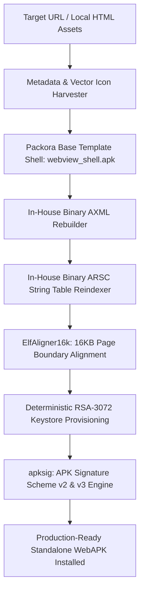
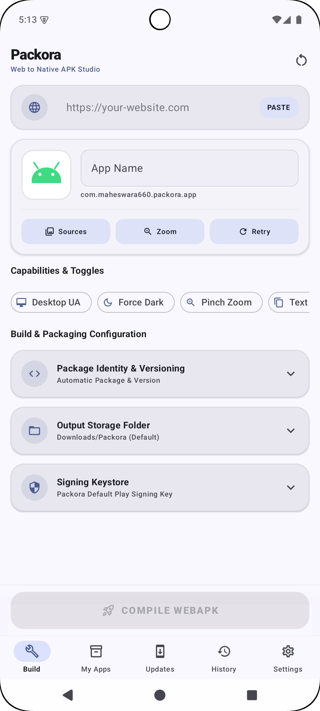
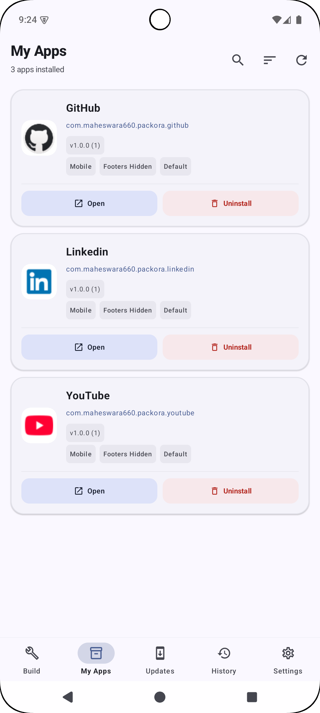
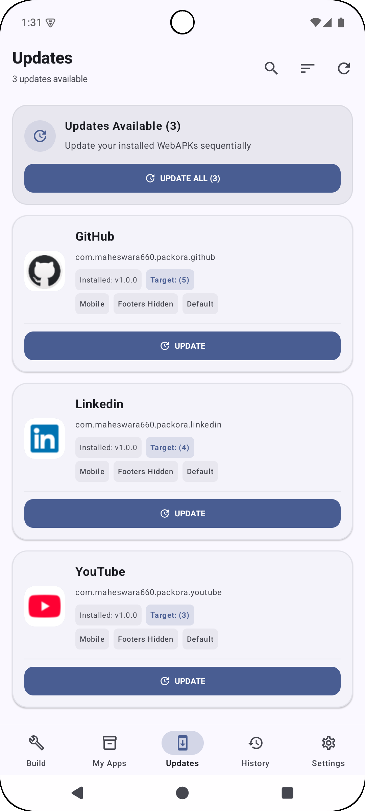
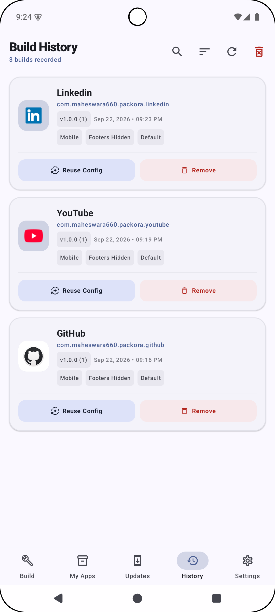
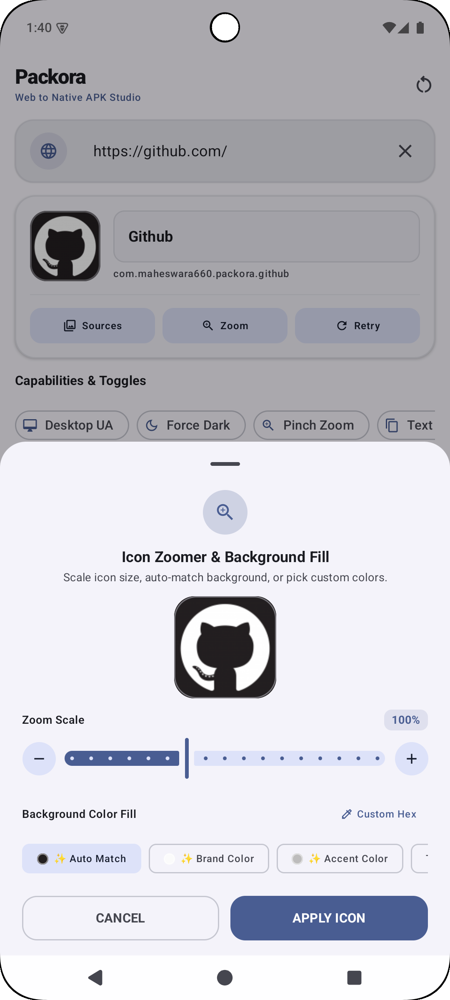
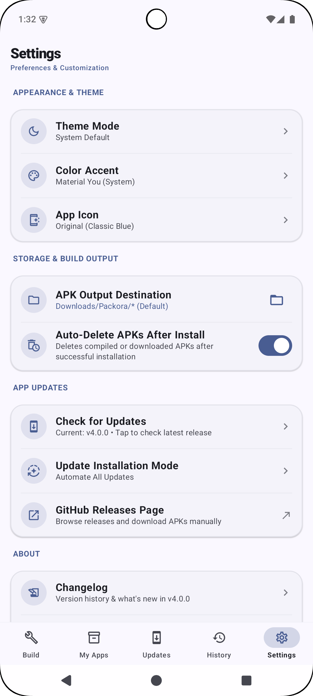

<p align="center">
  <a href="https://github.com/maheswara660/Packora">
    
  </a>
</p>

<h1 align="center">Packora v5.5.0</h1>

<p align="center">
  <b>Next-Gen Standalone Android WebAPK Studio — 100% On-Device, Offline & Privacy-Hardened.</b>
</p>

<p align="center">
  <a href="https://github.com/maheswara660/Packora/releases/latest"></a>
  <a href="https://maheswara660.github.io/Packora/"></a>
  <a href="https://kotlinlang.org"></a>
  <a href="https://developer.android.com/jetpack/compose"></a>
  <a href="https://developer.android.com/about/versions/15"></a>
  <a href="LICENSE"></a>
  <a href="https://github.com/sponsors/maheswara660"></a>
  <a href="https://ko-fi.com/maheswara660"></a>
</p>

> [!IMPORTANT]
> **100% On-Device Compilation • Zero Telemetry • Zero PC Dependency**  
> Packora runs an entire Android compilation, bytecode manipulation, resource rewriting, and APK signing pipeline directly on your phone or tablet. It transforms any web application, responsive website, offline HTML5 bundle, or frontend SPA into an independent, production-grade Android application in under 2 seconds.

---

## 📌 Table of Contents

- [Overview](#-overview)
- [Architecture & How It Works](#-architecture--how-it-works)
- [Five Core Execution Architectures](#-five-core-execution-architectures)
- [Key Features & Hardening](#-key-features--hardening)
  - [🛡️ 50+ Vector Stealth Privacy Shield](#️-50-vector-stealth-privacy-shield)
  - [🔒 Encrypted DNS-over-HTTPS (DoH)](#-encrypted-dns-over-https-doh)
  - [🚫 Built-in EasyList Ad & Tracker Blocker](#-built-in-easylist-ad--tracker-blocker)
  - [🔑 Deterministic Isolated Keystores](#-deterministic-isolated-keystores)
  - [📐 16KB ELF Page Boundary Alignment](#-16kb-elf-page-boundary-alignment)
  - [🔄 Updates Hub & Build History](#-updates-hub--build-history)
  - [📱 My Apps Studio Management](#-my-apps-studio-management)
- [Studio Gallery](#-studio-gallery)
- [Competitive Matrix](#-competitive-matrix)
- [Technology Stack](#-technology-stack)
- [Building from Source](#-building-from-source)
- [License & Credits](#-license--credits)

---

## 💡 Overview

Standard mobile browsers offer basic "Add to Home Screen" shortcuts, but those shortcuts remain bound to browser tabs, address bars, shared cookies, and browser lifecycle limits.

**Packora** compiles a **true standalone Android WebAPK** that:
- Runs in its own dedicated Android application process with isolated task affinity.
- Features custom package identifiers (`com.example.app`), custom launcher icons, and automatic version incrementing.
- Intercepts and randomizes over **50 device fingerprinting vectors** (Canvas 2D, WebGL GPU, AudioContext, DOM ClientRects, WebRTC local IP, Battery, Hardware Concurrency).
- Resolves all network traffic through **Encrypted DNS-over-HTTPS (DoH)** with 9 privacy resolvers.
- Blocks advertising networks and telemetry out of the box using a high-efficiency **EasyList engine**.
- Cryptographically signs APKs using **deterministic RSA-3072 keystores** supporting APK Signature Scheme v2 & v3 for conflict-free lifelong in-place updates.
- Strictly aligns all native shared libraries (`.so`) to **16KB page boundaries** for full compatibility with modern Android 15+ kernels.

---

## ⚙️ Architecture & How It Works

Packora bypasses cloud build servers and heavy desktop toolchains (like AAPT2, Gradle daemons, and Java SDKs) through low-level binary manipulation:


```mermaid
graph TD
    A[Target URL / Local HTML Assets] --> B[Metadata & Vector Icon Harvester]
    B --> C[Packora Base Template Shell: webview_shell.apk]
    C --> D[In-House Binary AXML Rebuilder]
    D --> E[In-House Binary ARSC String Table Reindexer]
    E --> F[ElfAligner16k: 16KB Page Boundary Alignment]
    F --> G[Deterministic RSA-3072 Keystore Provisioning]
    G --> H[apksig: APK Signature Scheme v2 & v3 Engine]
    H --> I[Production-Ready Standalone WebAPK Installed]
```

1. **Metadata & Asset Harvesting**: Automatically scrapes web manifests, high-res Apple touch icons, favicons, theme colors, and page metadata directly from the source.
2. **In-House Binary AXML Patching**: Direct in-memory byte manipulation of `AndroidManifest.xml` (AXML) to inject package names, application labels, and custom permissions without external toolchains.
3. **In-House Binary ARSC Rebuilding**: Directly modifies compiled Android binary resources (`resources.arsc`) to re-index string pools, application titles, and color palettes.
4. **16KB ELF Page Boundary Alignment**: In-place byte alignment of all native shared libraries within ZIP central directories to strict 16,384-byte boundaries for Android 15+.
5. **Deterministic RSA-3072 Signing**: Computes an isolated cryptographic identity derived deterministically from package coordinates, guaranteeing seamless in-place updates.

---

## 🏗️ Five Core Execution Architectures

Packora provides five specialized application architectures tailored for different web workloads:

| Architecture | Description | Key Capabilities |
| :--- | :--- | :--- |
| **`Web App (PWA)`** | Universal standalone Web application wrapper. | Full Service Worker support, CacheStorage, IndexedDB, custom User-Agents, pull-to-refresh, desktop mode. |
| **`Offline HTML5`** | Self-contained offline application bundle. | Assets packed into `assets/www/` with local file scheme access; runs 100% offline with zero internet required. |
| **`Frontend SPA`** | Optimized for React, Vue, Svelte, Vite, and Angular. | Automated client-side history & hash routing fallback; eliminates 404 errors on deep page refreshes. |
| **`Multi-Web Hub`** | Multi-domain destination workspace. | Interactive native dark pill navigation bar allowing instant switching between multiple configured endpoints. |
| **`Immersive Media`** | Audio and video streamer. | Screen wake lock (`FLAG_KEEP_SCREEN_ON`), continuous background audio playback, and gesture-free autoplay. |

---

## ✨ Key Features & Hardening

### 🛡️ 50+ Vector Stealth Privacy Shield
Modern commercial tracking networks (FingerprintJS, CreepJS, DataDome, Cloudflare Bot Management) fingerprint mobile devices by probing micro-differences in hardware and rendering engines. Packora injects protective hooks at the DOM layer before page scripts execute:

- **Canvas 2D**: Injects imperceptible cryptographic micro-noise into `toDataURL()` and `getImageData()`, randomizing canvas tracking hashes per session.
- **WebGL GPU**: Normalizes `UNMASKED_RENDERER_WEBGL` and GPU vendor strings to generic high-end Adreno/Mali profiles and masks shader precision readbacks.
- **AudioContext**: Adds micro-jitter (±0.0001) to audio oscillator buffer frequency readbacks, disrupting acoustic fingerprint curves.
- **DOM Geometry**: Fractional subpixel perturbation on `getClientRects()` and `getBoundingClientRect()` to prevent layout-based font and scaling telemetry.
- **WebRTC IP Leak**: Suppresses host-type ICE candidate generation, preventing intranet and VPN IP address exposure.
- **System Attributes**: Normalizes `navigator.deviceMemory` to 8GB, clamps `navigator.hardwareConcurrency` to 8 cores, and reports constant 100% battery state.
- **Session Hygiene**: Optional automatic wiping of cache, cookies, and local storage upon application exit.

---

### 🔒 Encrypted DNS-over-HTTPS (DoH)
Packora eliminates ISP tracking and DNS hijacking by resolving all network requests over encrypted HTTPS connections (RFC 8484). Choose from 9 built-in zero-logging resolvers:

1. **Cloudflare DNS** (`https://cloudflare-dns.com/dns-query`) — Ultra-fast Anycast network (1.1.1.1)
2. **Google Public DNS** (`https://dns.google/dns-query`) — Worldwide high-capacity resolver (8.8.8.8)
3. **AdGuard DNS** (`https://dns.adguard-dns.com/dns-query`) — Built-in ad, tracker, and malware blocking
4. **Quad9 DNS** (`https://dns.quad9.net/dns-query`) — Swiss privacy-focused security resolver
5. **Mullvad DoH** (`https://doh.mullvad.net/dns-query`) — Strict zero-logging audited privacy resolver
6. **Control D** (`https://freedns.controld.com/p0`) — High-performance resolver with zero telemetry
7. **DNS.SB** (`https://doh.dns.sb/dns-query`) — European privacy-first non-censored resolver
8. **CleanBrowsing** (`https://doh.cleanbrowsing.org/doh/security-filter/`) — Phishing and malicious domain protection
9. **OpenDNS** (`https://doh.opendns.com/dns-query`) — Cisco Anycast recursive DNS infrastructure
- **Custom DoH**: Option to configure any private or corporate HTTPS DNS endpoint.

---

### 🚫 Built-in EasyList Ad & Tracker Blocker
- **Zero-Proxy Request Interception**: Intercepts web resource requests directly in `WebViewClient.shouldInterceptRequest` against 70,000+ EasyList and EasyPrivacy domain rules.
- **Pre-Network Termination**: Blocked advertising and analytics requests are killed before packets leave the device, saving mobile data and accelerating load speeds.
- **0ms Early CSS Footer Suppressor**: Suppresses intrusive mobile sticky footers, download prompts, and app banners before initial paint via high-priority CSS stylesheet injection.

---

### 🔑 Deterministic Isolated Keystores
- **Zero Certificate Conflicts**: Eliminates Android "problem parsing package" and signature mismatch errors when updating installed apps.
- **Package-Isolated Identities**: Each WebAPK receives a unique RSA-3072 keystore derived deterministically from its package name, preventing security boundary bleed between different applications.
- **Full Signature Scheme Support**: Signs using APK Signature Scheme v1 (JAR signing) and v2/v3 (Whole-APK signing blocks).

---

### 📐 16KB ELF Page Boundary Alignment
- **Android 15+ Compatibility**: Modern Android kernels use 16KB memory page sizes instead of legacy 4KB boundaries.
- **Automatic Alignment**: Packora's internal `ElfAligner16k` automatically checks and re-aligns native shared libraries (`.so`) and uncompressed zip entries to strict 16,384-byte boundaries.

---

### 🔄 Updates Hub & Build History
- **Dedicated Updates Center**: Automatically monitors remote web manifests and API endpoints for version updates.
- **Batch Background Compilation**: Update multiple installed WebAPKs with one tap using animated progress tracking.
- **SHA-256 Integrity Verification**: Inspect cryptographic checksums, build timestamps, and package sizes for every compiled artifact.
- **1-Tap Config Reuse**: Instantly reload previous build configurations into Build Studio from history records.

---

### 📱 My Apps Studio Management
- **Centralized Dashboard**: Filter, search, categorize, and launch all created WebAPKs.
- **Startup App Scanning**: Scans installed packages once upon startup with in-memory session caching for instant, zero-lag navigation.
- **In-App Architectural Inspection**: Rich details sheet showing exact architecture targets, active privacy shield vectors, DoH resolver endpoints, and custom download locations.

---

## 📸 Studio Gallery

<div align="center">

| WebAPK Build Studio | My Apps Dashboard | Updates Hub |
| :---: | :---: | :---: |
|  |  |  |

| Build History & Artifacts | Icon Canvas Editor | Settings & Automation |
| :---: | :---: | :---: |
|  |  |  |

</div>

---

## 📊 Competitive Matrix

| Feature | Packora v5.5.0 | Chrome PWA Shortcut | Hermit Lite Apps | Bubblewrap / TWA |
| :--- | :---: | :---: | :---: | :---: |
| **Standalone Native APK** | ✅ Real APK File | ❌ Browser Tab | ❌ Sandbox Container | ✅ Real APK File |
| **100% On-Device Compilation** | ✅ No PC Needed | ✅ On-Device | ✅ On-Device | ❌ Requires PC & JDK |
| **Deterministic RSA-3072 Keys** | ✅ Per Package | ❌ N/A | ❌ Shared Certificate | ⚠️ Manual Setup |
| **50+ Vector Stealth Shield** | ✅ Comprehensive | ❌ None | ⚠️ Basic User-Agent | ❌ None |
| **Encrypted DNS-over-HTTPS** | ✅ 9 Resolvers | ❌ OS Default | ❌ OS Default | ❌ OS Default |
| **16KB ELF Page Alignment** | ✅ Android 15+ | ⚠️ Browser Dependent | ⚠️ Container Dependent | ⚠️ Toolchain Dependent |
| **EasyList Ad Blocking** | ✅ Native (70k+ rules) | ❌ None | ⚠️ Basic Filters | ❌ None |
| **License** | ✅ GPL-3.0 (Open) | ❌ Proprietary | ❌ Freemium / Closed | ✅ Open Source |

---

## 🛠️ Technology Stack

- **UI Framework**: [Jetpack Compose](https://developer.android.com/jetpack/compose) with Material 3 design system.
- **Language**: Kotlin 2.2+ targeting JVM 17.
- **Signing Engine**: Android `apksig` (APK Signature Scheme v1, v2, v3).
- **Cryptography**: BouncyCastle Provider (RSA-3072, PKCS12 keystore derivation).
- **Network Engine**: OkHttp 4 with DNS-over-HTTPS resolver plugins.
- **Target OS**: Android 7.0 (API 24) through Android 15+ (API 35).
- **Documentation Website**: Zero-dependency static site built purely in HTML5, CSS3, and Vanilla JavaScript.

---

## 🚀 Building from Source

### Prerequisites
- **JDK**: Version 17 or higher
- **Android SDK**: Build-Tools `35.0.0`, Platform `android-35`
- **Gradle**: 8.11+ (handled automatically by `./gradlew`)

### Build Commands
```bash
# Clone the repository
git clone https://github.com/maheswara660/Packora.git
cd Packora

# Build release template shell and stage into app assets
./gradlew :template:assembleRelease :app:copyTemplateApk

# Compile Packora debug APK and run unit tests
./gradlew :app:assembleDebug :app:testDebugUnitTest
```

Compiled APK output: `app/build/outputs/apk/debug/app-debug.apk`

---

## 📄 License & Credits

Packora is free and open-source software licensed under the **GNU General Public License v3.0 (GPL-3.0)**.  
See the [LICENSE](LICENSE) file for complete terms.

Created and maintained with ❤️ by **[Maheswara660](https://github.com/maheswara660)**.
