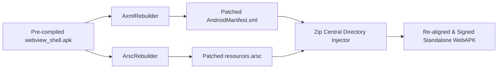

# In-House Binary Rebuilding Engine

Traditional APK generation tools require Android's Android Asset Packaging Tool (`aapt` or `aapt2`) and Java toolchains running on a desktop computer. Packora completely eliminates external toolchains by performing **in-house low-level binary rewriting** directly on Android.

---

## Direct Bytecode & Chunk Manipulation

### 1. `AxmlRebuilder` (Binary XML Patching)
- **Role**: Parses and modifies Android's compiled binary XML format (`AndroidManifest.xml`) at the byte level.
- **Operations**:
  - Updates the `package` attribute in the root `<manifest>` chunk.
  - Modifies package names across activity components, application tags, and file providers.
  - Updates string pool indexes and UTF-8/UTF-16 string chunk offsets.
  - Re-encodes the binary AXML file while preserving byte alignment.

### 2. `ArscRebuilder` (Binary Resource Table Patching)
- **Role**: Parses Android's compiled resource table format (`resources.arsc`).
- **Operations**:
  - Locates the `app_name` string resource entry in the string pool chunk.
  - Replaces the string with the custom user-defined application title.
  - Adjusts string table offsets, string count headers, and resource map entries.

### Zero Toolchain Overhead
By executing byte manipulation directly in memory buffers:
- Compilation completes in **2–5 seconds** on modern Android devices.
- No heavy desktop toolchains, command-line wrappers, or JVM emulators are required.
- Works 100% offline with zero cloud server dependencies.
