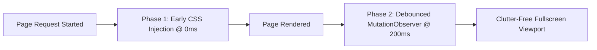

# 150+ Multilingual Smart Footer Hider

Mobile websites frequently display intrusive sticky footers, "Open in App" banners, cookie consent strips, and promotional clutter that take up 20%–40% of the mobile viewport. Packora features an intelligent **Smart Footer Hider** that removes this clutter while strictly preserving navigation bars, checkout forms, and modals.

---

## Dual-Phase Injection Pipeline

### Phase 1: 0ms Early CSS Injection
- **Timing**: Injected immediately inside `onPageStarted` and when progress reaches 15%.
- **Targeting**: Injects CSS stylesheet rules (`display: none !important`) for common sticky footer containers (`footer`, `[role="contentinfo"]`, `#footer`, `.site-footer`, `.page-footer`).
- **Benefit**: Eliminates visible layout shifts and screen flashes before the first pixels are painted.

### Phase 2: Debounced MutationObserver
- **Timing**: Active during page rendering, scanning with 200ms debouncing.
- **Multilingual Term Engine**: Matches against a dictionary of 150+ keywords across 16 languages (English, German, French, Spanish, Portuguese, Italian, Dutch, Polish, Swedish, Russian, Japanese, Chinese, Korean, Hindi, Arabic, Turkish).

### Layout Safeguards
To ensure that web application usability is never compromised:
- **Height Bounds**: Elements exceeding 35% of the viewport height are never hidden.
- **Protected Tags**: Never hides `<main>`, `<article>`, `<form>`, `<nav>`, or elements inside active modal dialogs.
- **Overflow Restoration**: Restores body `overflow: visible` to prevent trapped scroll states from broken third-party consent modals.
