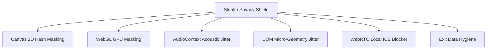

# Stealth Privacy Shield (50+ Vectors)

The **Stealth Privacy Shield** in Packora injects a comprehensive suite of anti-fingerprinting defenses directly into the WebAPK runtime. It disguises device hardware characteristics, acoustic profiles, and network topologies, neutralizing commercial tracking scripts and fingerprinting libraries (such as FingerprintJS, CreepJS, and cross-site analytics engines).

---

## Protected Attack Vectors

### 1. Canvas 2D Protection
- **Attack Vector**: Tracking scripts render invisible text, shapes, and gradients to an offscreen HTML5 `<canvas>`, then read back pixel data via `toDataURL()` or `getImageData()` to generate a unique device hash.
- **Mitigation**: Packora injects deterministic, imperceptible microscopic noise into the pixel buffer before returning data. Every invocation produces a subtly shifted hash, breaking persistent device tracking while keeping web pages visually crisp.

### 2. WebGL GPU Disguise
- **Attack Vector**: Inspecting `UNMASKED_VENDOR_WEBGL`, `UNMASKED_RENDERER_WEBGL`, and shader precision tables to uniquely identify device GPU hardware.
- **Mitigation**: Overrides WebGL context parameters to report standardized, high-performance Adreno/Mali GPU profiles and masks high-precision floating-point shader characteristics.

### 3. AudioContext Hardening
- **Attack Vector**: Generating high-frequency oscillator audio curves and analyzing digital-to-analog converter (DAC) buffer latency to profile device sound hardware.
- **Mitigation**: Injects microscopic frequency jitter into `AudioBuffer` and `AnalyserNode` frequency response curves, randomizing audio tracking signatures.

### 4. DOM Micro-Geometry Jitter
- **Attack Vector**: Measuring subpixel typography and bounding box dimensions via `getClientRects()` and `getBoundingClientRect()` to detect screen DPI, system font antialiasing, and viewport scaling.
- **Mitigation**: Introduces subpixel floating-point jitter (+/- 0.0001px) to prevent micro-layout profiling.

### 5. WebRTC Local IP Leak Blocker
- **Attack Vector**: Creating unconstrained `RTCPeerConnection` instances to harvest private intranet IP addresses (e.g. `192.168.x.x` or `10.x.x.x`) via local ICE candidates.
- **Mitigation**: Filters out host-type ICE candidate generation, ensuring only external public candidates are transmitted when WebRTC calls are active.

### 6. Exit Data Hygiene
- **Behavior**: When enabled, automatically clears WebView cache, DOM local storage, session storage, and cookie jars whenever the user closes the app.
